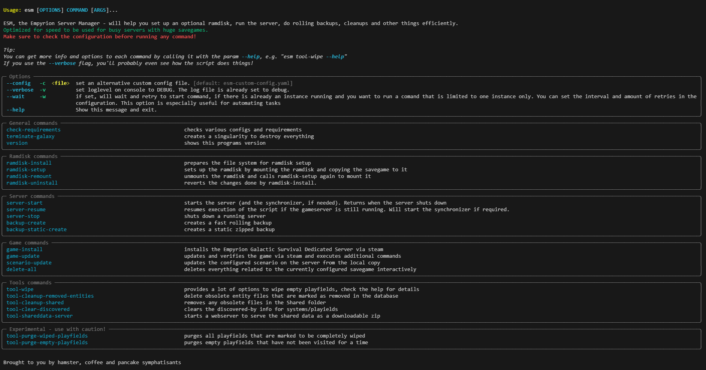

# ESM - Empyrion Server Manager

Sophisticated console client to manage an Empyrion Galactic Survival Dedicated Server.

Built to manage servers with a **lot** of players and **huge** savegames (>>**20GB**) perfomantly, adding a lot of performance optimizations to the way the server runs. The main features being fully automated support for running the game on a ramdisk, a blazing fast rolling backup system and a series of tools for managing the galaxy and keeping savegame size as small as you wish.

Its meant to run fully automated, so you only need to configure it once, then set up the timetable in EAH and forget about any problems you had.

## Features

### Ramdisk
- automatically sets up and runs a game on a ramdisk, which eliminates most server performance problems
- ability to "prepare" the filesystem for ramdisk usage, aswell as to revert that again if you have a running server already
- automatically externalizes the savegame templates back to HDD to reduce the needed ramdisk space by ~40%

### Backups
- provides its own (eah compatible) rolling mirror backup system, that backs up a 50GB savegame in under a minute without even affecting game server performance
- ability to create static (zipped) backups

### Convenience
- delete all function to remove any traces of an existing savegame, when you want to start a new season
- almost all features, limits, timeouts and paths are configurable
- everything is logged in console and logfiles, so you can always see what the scripts do, did and what happened when.
- freely configurable in-game announcer for a few actions
- special downloadserver as tool, that creates and serves the shared data folder as manually downloadable zip, see [performance section](data/readme_performance.md) or the ...
- [shareddata-server tool](data/readme_shareddata.md) that will fully automate the SharedDataURL feature by creating the zip automatically and serving it via the esm downloadserver

### Game maintenance / performance
- wipe tool for wiping playfields with no player or player-owned terrain placeables or structures.
- tool to clear the "discovered-by" infos from playfields and/or systems
- purge-tools to delete old playfield files, delete the related structures and templates - this will keep your savegame small if used regularly.
- some other tools to clean up and remove obsolete files and data
- update-scenario command that will make sure only changed files are updated (to minimize server file redownloads on scenario updates)
- can install the game for you (from steam)
- can update the game for you (from steam) and do additional operations (like copy custom files, etc.)
- fully integrated to be used with EAH
- supports a direct starting mode (without launcher), when you're running several instances of the game on one machine.
- various tools to manage the galaxy

### Other 
- hAImster integration

### Screenshot



## Requirements

- 3rd party: installed steamcmd executable, see <https://developer.valvesoftware.com/wiki/SteamCMD>
- 3rd party: osfmount as the free ramdisk driver (see <https://www.osforensics.com/tools/mount-disk-images.html>)
- 3rd party: peazip as the open source packer for static backups (see <https://peazip.github.io/>)
- ability to edit yaml and batch files (notepad will do, i'd recommend notepad++ or vscode though)
- admin-privileges, required to mount a ramdrive, when ramdisk usage is enabled

provided:
- 3rd party: EmpyrionPrime.RemoteClient by notoats (see <https://github.com/notOats/EmpyrionPrime>)

optional:
- a running hAImster server

## All about performance, ramdisk, shared data downloads and more

[This](data/readme_performance.md) will tell you all you need to know about it.
If you're interested improving network limitations in the game, read about [the shareddata-server tool](data/readme_shareddata.md)

## All about the backups

You'll want to [read this](data/readme_backups.md).

## How to install ESM, the game, everything

Please follow this [path](data/readme_install.md).

## RUNNING WITH EAH
1. Select the custom provided **esm-starter-for-eah.cmd** file as dedicated starter script in EAH -> Config -> Tool -> Setup -> "Use Dedicated.cmd". That script will run the `esm server-start` which starts the server.
1. Select the **esm-dedicated.yaml** in EAH that you copied into the installation dir
1. DONE, use EAH as before.

In the timetable, you can use the "Run shell" task and call any script from there. If you want to start long running scripts that can run in the background (e.g. the backup), create a copy of the provided `callesm-async.example.bat` in the empyrion installation dir, and edit that so it points to the correct esm installation dir and calls the esm function you'd like to execute.

Example:
- create `callesm-backup-async.bat` from the template callesm-async.example.bat (edit your file to call `esm backup-create`)
- add a "Run Shell" subtask in EAH's time table for your restarts and enter the full path of your script, e.g. `D:\Servers\Tools\esm\callesm-backup-async.bat`
- Done.

These "-async" scripts start the real script asynchroneously in the background and finish immediately, so EAH does not get blocked, the "-sync.bat" script does practically the same, but executes the script **synchroneously**, that means it will block the caller (eah) until it finishes.
You can absolutely automate a whole server maintenance this way, e.g. have the server automatically create a backup, shut down, update, change a config, wipe half the galaxy and start up again in the middle of the night while you're sleeping :)
The custom backup system is compatible with EAH, so you can select them when restoring stuff from EAH. The backup system also backs up EAH's tool data.

### EAH limitations
- EAH's "Run shell" task does not support passing parameters to scripts as command line arguments, so you have to create custom batch files for every command you want to execute there.
- EAH's "Run shell" task calls are **synchroneous**. This means that EAH will be **blocked** until the script finished. Use the -async scripts to solve that.
- If you configure your **own "dedicated.yaml"** in EAH **and** use a dedicated start script, it will **not use that dedicated.yaml** to start the server automatically! You will have to configure that in your own dedicated start script. If you use the provided script, it will do that for you.
- EAH's "wipe savegame" deletes only half the stuff that should be deleted (no cache, no EAH data, no logs, no backups etc.)
- EAH's "wipe empty savegame" ignores terrain placeables and can take **~40 hours** for a 30GB savegame - yes thats a few days of downtime.(!)
- EAH's backup system does not work properly for large savegames. Its "cleanup" method starts removing backups after a few hours already. Also, creating a full backup for a huge savegames can take **hours**. Deleting takes **hours** too - you guessed right, if you're unlucky, EAH could kill your server.

## RUNNING WITHOUT EAH
Just start the server with `esm server-start`. You can CTRL+C out of it, this will not stop the gameserver, but the ram-synchronizer will stop working (if ramdisk usage is enabled). Just use `esm server-resume` to re-attach to the running gameserver and restart the ram-synchronizer.
You can stop the server with either `esm server-stop`, EAH or clicking the 'save and exit' button in the graphical overlay (if enabled).

## filesystem structure (default)
This is how the file system tree looks like, when it is set up after ramdisk-install, ramdisk-setup and a few create-backup runs (default configuration, only important bits are shown)

```text
D:\Server\Empyrion (as an example for your Empyrion game install directory)
├───Saves
│   ├───Games
│   │   └───*EsmDediGame              links to ramdisk -> R:\DediGame
│   └───GamesMirror
│       ├───EsmDediGame_Mirror        (the current HDD copy of the ramdisk savegame, gets synced regularly)
│       └───EsmDediGame_Templates     (if externalizeTemplates is enabled, this *is* the Template folder used by the game)
└───Backup
    ├───*20230627 012345 Backup       links to -> BackupMirrors/rollingMirrorBackupX (X changes)
    ├───*20230627 123456 Backup       links to -> BackupMirrors/rollingMirrorBackupX (X changes)
    ├───*20230628 012345 Backup       links to -> BackupMirrors/rollingMirrorBackupX (X changes)
    ├───*20230628 123456 Backup       links to -> BackupMirrors/rollingMirrorBackupX (X changes)
    └───BackupMirrors                 (Folder for the rolling backups, amount of backups depends on config)
        ├───rollingMirrorBackup1
        ├───rollingMirrorBackup2
        ├───rollingMirrorBackup3
        └───rollingMirrorBackup4

R:\EsmDediGame (our savegame in the ramdisk)
├───Content
├───Players
├───Playfields
├───Sectors
├───Shared
├───Stamps
├───*Templates                        if externalizeTemplates is enabled, links to HDD -> D:\Server\Empyrion\Saves\GamesMirror\EsmDediGame_Templates
└───global.db
```

## About disk space
The ramdisk setup keeps a mirror of the savegame on the HDD, it also keeps the templates on the HDD, that makes up for ~1,5 savegame sizes. Every rolling backup also contains a whole savegame (and some EAH tool data) - the amount defaults to 4. That means that if your savegame is 50GB, you'll need **5,5** times that as free space which ends up as **~275GB**. 

## TIPS
- use the `esm --help` command, and get help for each command with `esm command --help`. This explains stuff and you can get the details directly from there.
- do not edit the `data/esm-default-config.example.yaml`, it is meant as a documentation for your configuration file with a lot of explanations for you. Override these settings in your own `esm-custom-config.yaml`
- open a windows console first, then start the scripts for the manual execution. This will avoid the console windows getting closed after the scripts finished so you can read the log.
- all scripts generate logs of what they do, you can always read up anything there.
- in windows consoles, disable the "quick edit mode", since this **will suspend the execution of scripts(!) and potentially break things**! See https://superuser.com/questions/459609/what-does-it-do-exactly-if-i-click-in-the-window-of-cmd
- NTFS is slow for such huge amount of files & folders. Disable 8dot3 name generation and/or strip them from existing saves, see: https://learn.microsoft.com/de-de/archive/blogs/josebda/windows-server-2012-file-server-tip-disable-8-3-naming-and-strip-those-short-names-too
  the game works fine without it. `esm check-requirements` will also check for this.
- disable file indexing on the drives the game runs and backups reside. Explorer -> RMB on drive -> General -> uncheck "allow indexing"
- the game server keeps an ever-growing cache (see cache folder) that has no limits and grows insanely fast - delete that regularly
  (the game does this on updates sometimes) or it will eat up all your disk space.
- deleting millions of files is even slower on NTFS than creating them, use quick delete to remove large amount of files (basically del /f/q/s and rmdir /s/q). The deleteall command will do that already and hopefully covers most of your usecases. Check the esm configuration if you need to delete more every season.
- execute any command with the `-v` switch to see exactly what it does - or read the logfile. It is made for humans.

## KNOWN ISSUES
- open windows consoles may pause scripts with the quick edit function. This is terrifying and there's no workaround for the scripts - **turn it off** (see tips) - although turning it off doesn't seem to work reliably either! If you see the "Running Server"-spinner moving, its fine. If it stops, your console froze and the program **is suspended**. Click into it or press Enter until the program continues execution.
- the ramdisk-setup command will not run properly if in the "Autostart" folder of your windows user, due to how windows handles that "need admin privileges" popup on startup.
- the delete-all sometimes will fail to unmount the ramdrive. In that case start osfmount yourself and unmount it yourself.

## FAQ
Q: Trying to start the server in EAH, there are a few consoles popping up and say something like "script is already running, will wait 10 seconds to retry.".\
A: ESM makes sure it runs only once per configuration. If you have a running instance, stop that first or wait until it finishes doing what it is doing. If you run multiple instances of it on the same server, you need to change the bindingPort in the configuration.

Q: On a gameserver restart, the script doesn't react any more\
A: You probably clicked in its window and activated the "quick-edit" mode of the console. This **will suspend** the script! Click on it again or on the title bar to un-pause it. Check the tips on how to avoid that issue altogether. If you see the spinner spinning, everything is fine.

Q: My terminal/console just shows garbled up characters and strange things like 36m, 2m and 0m everywhere.\
A: Search for a setting in your terminal/console that controls something like "support for ANSI", or "VT100 drawing support" and enable that.

## developing and contributing

Go down this [rabbit hole](data/readme_development.md).

#### copyright by Vollinger 2023-2025
